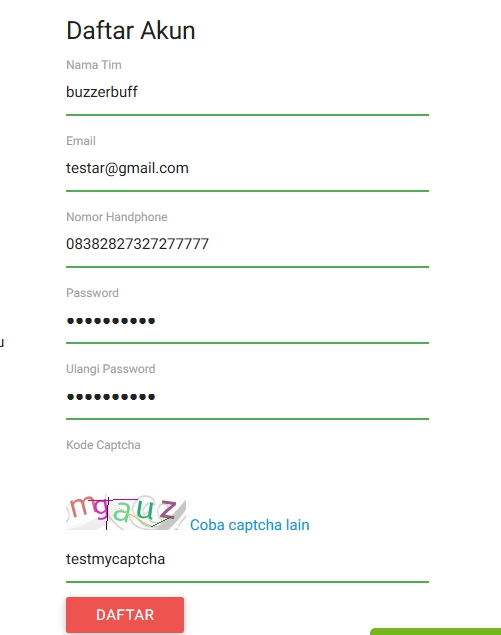
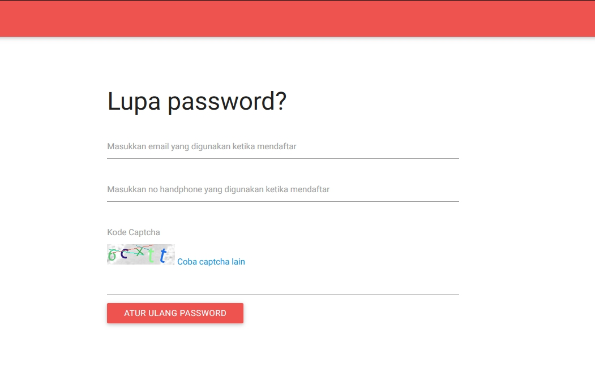
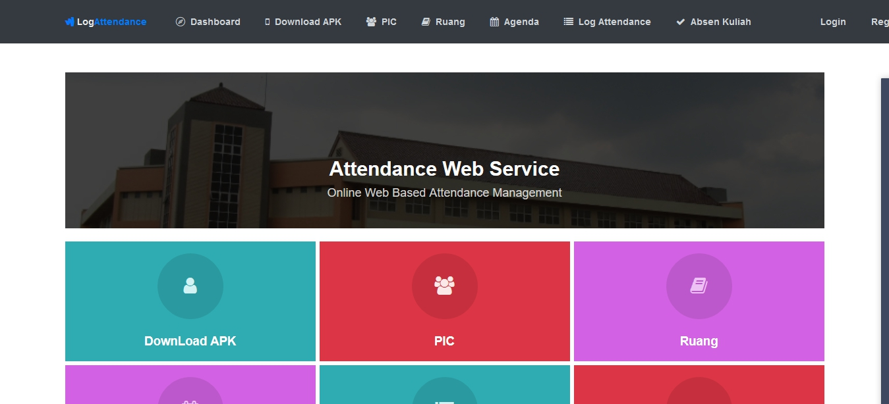
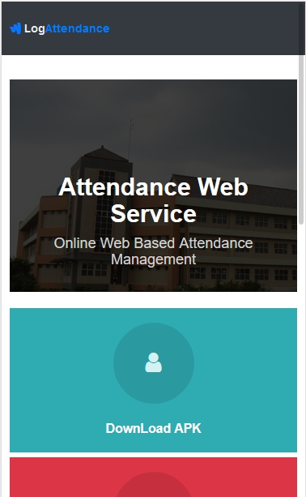

## BIO
Name : Andika Andra. 
NRP : 05111640000058 
Github : [andikaandra](https://github.com/andikaandra)

---

## Website with bad UI

1. ### [IEFAIR](http://ie-games.iefairits.com)
1. ### [Attendance Web Service](http://etc.if.its.ac.id)
1. 

---

### IEFAIR 
[ie-games.iefairits.com](http://ie-games.iefairits.com) is a login page from main website [ie-games](https://www.iefairits.com/) created for the needs of publication of events from one of the departments at ITS, the main page is clearly fine, but i think the developers need to fix about the register form.
    
at the first sight the page looks fine, but the fatal mistakes is when i submitted the form (register), MY ACCOUNT SUCCESSFULLY CREATED :disappointed_relieved: . the captcha code that i wrote is wrong but the form is successfully passed.
  
after my account created, and redirected to my dashboard,then i logged out, i tried to check forgot password page, lets check the picture below
    
maybe this is the simple thing, but the page dont have "the link" to go back to homepage or previous page. so user manually to go to homepage. and the first proglem repeated again, the captcha code that i wrote is wrong but the form is successfully passed. :blush:

#### is there a better solution?
for the first problem i think developer should do a testing for every scenario/case, captcha must be exactly the same as the user wrote. **never trust user input**. for the second problem at least in the Navbar there must be a logo that linked to homepage.

 

---

### Attendance Web Service
[etc.if.its.ac.id](http://etc.if.its.ac.id) is our website that used to fill attendance lists, it is a great app and have cool function :fire:, but there is a litle problem with the navbar layout.
    
on the last visit to the site, i found the register link on the top right is only half part. i think that caused because there is too much navbar-link 
  
and after i check on the phone size layout, i dont find any navbar-link on the navbar
    
so if i want to go to login page i have to write the url manually, but if i dont have enough time to change my url, i just click on the other menu (ruang, pic, etc) and it automatically redirected to login page because the middleware. :grin: 

#### is there a better solution?
for the first problem i think if you have many navbar-link, you should make it as collapsable, and for the second one is just make your web responsive as possible. but overall the app is very very good and have much feature. :+1: