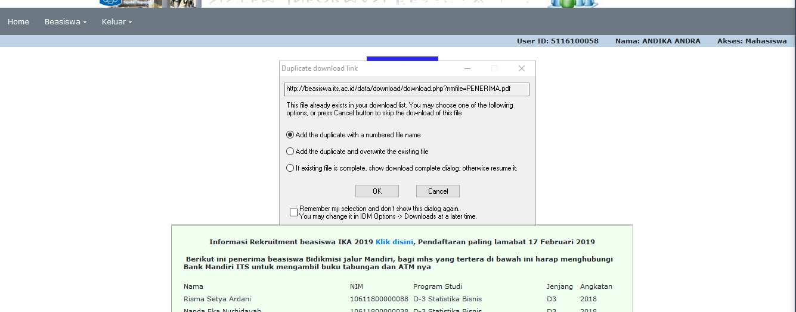
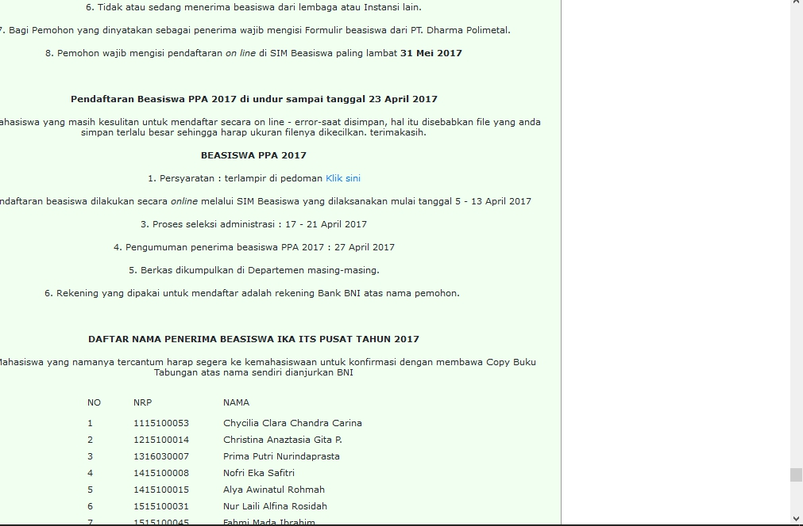

## BIO
|-|-|
------------ | -------------
Name | Andika Andra
NRP | 05111640000058
Github | [andikaandra](https://github.com/andikaandra)

---

## Website with bad UI
#### Outline
1. Attendance Web Service
   * [Attendance Web Service](http://etc.if.its.ac.id)
   * [Description](#attendance-web-service)
   * [Suggestion](#is-there-a-better-solution)
   * [Demo](https://youtu.be/Y41O6syArnU)
1. Integra Scholarship System Information
   * [*SI* *Beasiswa*](http://beasiswa.its.ac.id/data/home.php)
   * [Description](#integra-scholarship-system-information)
   * [Suggestion](#is-there-a-better-solution-1)
   * [Demo](https://youtu.be/XsG2ySSvdIU)
1. IEFAIR
   * [IEFAIR](http://ie-games.iefairits.com)
   * [Description](#iefair)
   * [Suggestion](#is-there-a-better-solution-2)
   * [Demo](https://youtu.be/_p5Wj2Yons8)
---

### Attendance Web Service
[etc.if.its.ac.id](http://etc.if.its.ac.id) is our website that used to fill attendance lists, it is a great app and have cool function :fire:, but there is a litle problem with the navbar layout.
    
on the last visit to the site, i found the register link on the top right is only half part. i think that caused because there is too much navbar-link 
 
and after i check on the phone size layout, i dont find any navbar-link on the navbar
    
so if i want to go to login page i have to write the url manually, but if i dont have enough time to change my url, i just click on the other menu (ruang, pic, etc) and it automatically redirected to login page because the middleware. :grin: 

#### Is there a better solution?
for the first problem i think if you have many navbar-link, you should make it as collapsable, and for the second one is just make your web responsive as possible. but overall the app is very very good and have much feature. :+1: :+1:

 

---

### Integra Scholarship System Information
[*SI* *Beasiswa*](http://beasiswa.its.ac.id/data/home.php) is system information about scholarship in ITS
    
every time I open the page, it shows popup to download file *PENERIMA.pdf*, after I downloaded, it appeared to contain a list of recipients one of scholarship program, but not every user registered to that scholarship program, i think that popup quite annoying.
 
and i highlight one more thing about this site is there is too much information loaded in one page and the information is irrelevant in terms of time, check the picture below
    
look at the scrolling bar on the right side :sweat_smile:. and if i scrolled to the bottom, the information is about scholarship at 2017, it's 2 years ago and i think that's not suitable for now.

#### Is there a better solution?
for the first problem i think there should be a button to download file so the user doesn't think "what file is this?" "is this important to me?" "should i download it?". for the second problem i think there should be a listing to separate by year, if user try to looking about scholarship at 2017 so just choose the list in 2017, it should be better experience and make it easier for users to use.

 

---

### IEFAIR 
[ie-games.iefairits.com](http://ie-games.iefairits.com) is a login page from main website [ie-games](https://www.iefairits.com/) created for the needs of publication of events from one of the departments at ITS, the main page is clearly fine, but i think the developers need to fix about the register form.
    
at the first sight the page looks fine, but the fatal mistakes is when i submitted the form (register), MY ACCOUNT SUCCESSFULLY CREATED :disappointed_relieved: . the captcha code that i wrote is wrong but the form is successfully passed.
 
after my account created, and redirected to my dashboard then i logged out, i tried to check forgot password page, lets check the picture below
    
maybe this is the simple thing, but the page dont have "the link" to go back to homepage or previous page. so user manually to go to homepage. and the first proglem repeated again, the captcha code that i wrote is wrong but the form is successfully passed. :blush:

#### Is there a better solution?
for the first problem i think developer should do a testing for every scenario/case, captcha must be exactly the same as the user wrote. **never trust user input**. for the second problem at least in the Navbar there must be a logo that linked to homepage.
